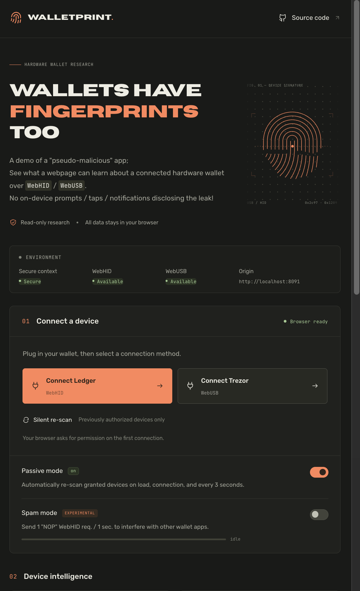
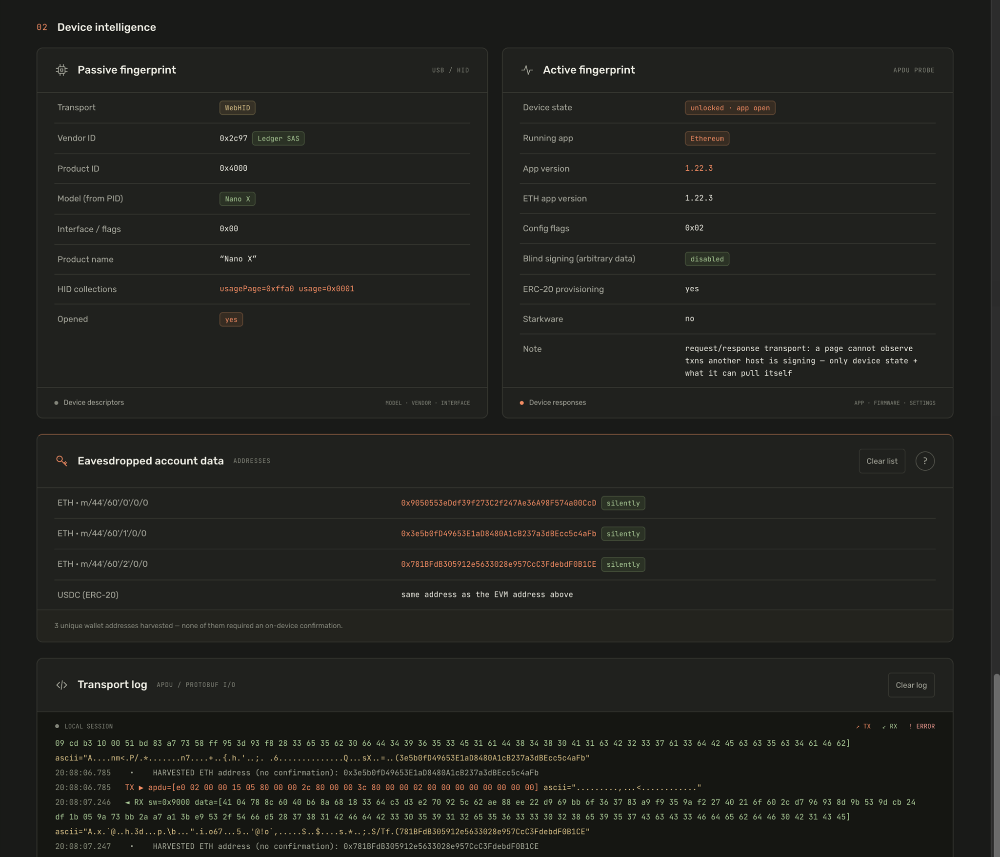

        <code> [ Have a look at the demo: <a href="https://qwqoro.github.io/walletprint/"><code>qwqoro.github.io/walletprint</code></a> ] </code>  
  	<b>
		<a href="#-overview">Overview</a> | 
		<a href="#%EF%B8%8F-usage">Usage</a> | 
		<a href="#-more-on-the-topic">More on the topic</a>
	</b>

 

> A demo application, Proof-of-Concept – showing you what information can a specially crafted webpage extract from the Hardware Crypto Wallet you've connected via USB.

&ensp;
 

# 📦 Overview

> `[⚠️]  Disclaimer`
> 1. Yes, the demo itself is vibecoded, sorry about that!
> 2. Prerequisites & key features:
>    - **Silent** = 0-clicks / approvals / notifications on the wallet;
>    - Basic data leak (model, OS version, battery %):&ensp;`CONNECTED VIA USB`, `LOCKED / UNLOCKED`
>    - App-specific data leak (version, settings, wallet address):&ensp;`CONNECTED VIA USB`, `UNLOCKED`, `TARGET APP IS ACTIVE`
>
> 3. It is important to understand that this demo is based on a **legitimate functionality, which works as intended** – both WebHID & WebUSB expect you to trust the "host" device you connect your "peripheral" device to.
> 4. **No truly sensitive data (PIN, private keys) gets leaked** through the method utilized here – your assets remain safe.
> 5. This demo should not be used to make assumptions about companies or their products; No part of this project should be interpreted as one's (mine, yours, ours, employer's, ...) opinion.
> 6. This demo must not be used for any purpose, other than research – run against your own / explicitly authorized devices only.

 

A single-page live demo app that, the moment it gains WebHID / WebUSB access, harvests everything the transport reveals about a connected hardware wallet with **no on-device prompts**.

**Client-Side & Read-only**: no sensitive data is ever requested + nothing leaves the browser (it is a single `html` page hosted on Github pages, so..).
  

### 📊&ensp;Techniques & Results

| Target | Technique | Silent? | Impact / Leaked data |
|---|---|---|---|
| Ledger | HID descriptor (`vendorId` / `productId`) | ✅ | Exact model |
| Ledger | `getDevices()` on return visit | ✅ | Re-identifies the device with no chooser |
| Ledger | `GET_APP_AND_VERSION` (`b0 01 00 00 00`) | ✅ | Running app + its version |
| Ledger | `getDeviceInfo` (`e0 01 00 00 00`) | ✅ | SE firmware, MCU, `targetId` → model |
| Ledger | `e0 10` | ✅ | Battery % |
| Ledger | `listApps` (`e0 de` / `e0 df`) | ❌ | List of installed applications |
| Ledger | ETH `getAppConfiguration` (`e0 06 00 00 00`) | ✅ | ETH app settings: blind signing, ERC-20, Starknet |
| Ledger | ETH `getAddress` `e0 02 00 00` (P1=0) | ✅ | ETH addresses (= USDC/ERC-20, Hyperliquid) |
| Ledger | BTC \[legacy\] `getWalletPublicKey` (`e0 40`, P1=0) | ✅ | Account `xpub` / `zpub` → every address + full balance / history offline + first receive addresses |
| Ledger | BTC \[new\] `GET_MASTER_FINGERPRINT` + `GET_EXTENDED_PUBKEY` (`e1 00`, display=0) | ✅ | Account `xpub` / `zpub` → every address + full balance / history offline + first receive addresses |
| Ledger | Solana `e0 05` / Tron `e0 02` / XRP `e0 02` / Hyperliquid `e0 02`, ... (P1=0 / display=0) | ✅ | SOL, TRX, XRP, Hyperliquid, ... addresses |
| Ledger | TON / GRAM `e0 05` | ✅ | ed25519 public key (address needs wallet-contract — experimental) |
| Trezor | `GetFeatures` (WebUSB, protobuf) | ✅ | Wallet labels, `device_id`, language, model, fw, PIN/passphrase settings |
| Trezor / other | WebUSB device descriptor | ✅ | `serialNumber` (stable cross-site tracker), version |
 

> The app auto-detects which protocol the active app uses. 
> - USDC has no address of its own; it rides the ETH (ERC-20), Solana (SPL), Tron (TRC-20) address
> - Non-EVM / Bitcoin addresses that aren't returned by the device (e.g: XRP, the new BTC app's receive addresses, ...) are derived Client-side (`hash160` + `bech32` / `base58check`), thus flagged `[verify]` in the UI

 

| App | Ledger Live address path prefix |
| :-- | :-- |
| EVM (ETH / Hyperliquid) | `44'/60'/N'/0/0` |
| Solana | `44'/501'/N'/0/0` |
| Tron | `44'/195'/N'/0/0` |
| XRP | `44'/144'/N'/0/0` |
| TON / GRAM | `44'/607'/N'/0/0` |
| BTC (Legacy) | `44'/0'/N'` |
| BTC (Nested SegWit) | `49'/0'/N'` |
| BTC (Native SegWit) | `84'/0'/N'` |
| BTC (Taproot) | `86'/0'/N'` |

&ensp;

### 🪫&ensp;Limitations
- **PIN** / **button presses** — handled securely, never streamed to the "host" device;
- **Account names** — Ledger / Trezor store these names in Ledger Live / Trezor Suite metadata *off-device*;
- **Pending operations / Statuses of inactive apps** — requests / responses are handled within a "1-host" session, so this app cannot keep "watching" while another operation takes place&ensp;( _// this is the exact behaviour the `Spam mode` relies on_);

 
&ensp;

# ⚙️ Usage

1. Go to [qwqoro.github.io/walletprint](https://qwqoro.github.io/walletprint/)
2. Turn on your hardware wallet + Connect it via USB
3. Click `Connect WebHID (Ledger)` / `Connect WebUSB (Trezor)`, select your hardware wallet / \[Enable `Passive mode`\] → Watch `Passive fingerprint`
   - \[For "DoS"\]&ensp;Enable `Spam mode` → Watch errors in other apps that try to connect to the wallet
   - \[For app data leak\]&ensp;**Unlock** + **Open the target app** → Watch  `Active fingerprint` & `Eavesdropped account data`

### 🩺&ensp;Passive mode
| ⠀ | ⠀ |
| :-- | :-- |
| **Default value** | ✅&ensp;Enabled |
| **Behaviour** | Re-fingerprints every already-granted device  •&ensp;Every 1 sec:&ensp;checks which app is active;   •&ensp;Every app change:&ensp;performs full harvest |

### 🚿&ensp;Spam mode

| ⠀ | ⠀ |
| :-- | :-- |
| **Default value** | ⭕️&ensp;Disabled |
| **Behaviour** | Every 1 sec:&ensp;sends "NOP" requests to block other possible requests to the device |

When the `Spam mode` is on, the page fires a lot of "NOPs" at the Ledger via `HIDDevice.sendReport`.

\/\/&ensp;WebHID has no NOP primitive, so this application uses an `OUT` report with a harmless payload. The device serialises USB work → a steady stream contends with other hosts (e.g: Ledger Live). The status bar shows the rate (packets/s) and running total — the rate is controlled with the `setInterval(spamTick, …)`.

 

# 📑 More on the topic

- `[WebHID]` `[Ledger]` 
   - WebHID API: [developer.mozilla.org/.../WebHID_API](https://developer.mozilla.org/en-US/docs/Web/API/WebHID_API)
   - **Web Platform Incubator Community Group** ‟WebHIB API Specification”: [wicg.github.io/webhid](https://wicg.github.io/webhid/)

- `[WebUSB]` `[Trezor]` 
   - WebUSB API: [developer.mozilla.org/.../Web/API/USB](https://developer.mozilla.org/en-US/docs/Web/API/USB)
   - **Web Platform Incubator Community Group** ‟WebUSB API Specification”: [wicg.github.io/webusb](https://wicg.github.io/webusb/)

- `[Ledger]` 
   - Ledger device & transport identifiers: [developers.ledger.com/.../identifiers](https://developers.ledger.com/docs/device-interaction/references/identifiers)
   - Ledger clear-signing / ERC-7730: [developers.ledger.com/.../clear-signing/for-wallets](https://developers.ledger.com/docs/clear-signing/for-wallets)

- `[npm]` `[WebHID]` `[Ledger]` 
`@ledgerhq/hw-transport-webhid`:&ensp;[npmjs.com/.../@ledgerhq/hw-transport-webhid](https://www.npmjs.com/package/@ledgerhq/hw-transport-webhid)

- `[npm]` `[Ledger]` `[ETH]` 
`@ledgerhq/hw-app-eth`:&ensp;[npmjs.com/.../@ledgerhq/hw-app-eth](https://www.npmjs.com/package/@ledgerhq/hw-app-eth)

- `[Ledger]` `[ETH]` 
2026, Ledger Ethereum-app signature-mismatch patch: [cryptoticker.io/ledger-ethereum-app-signature-flaw](https://cryptoticker.io/en/ledger-ethereum-app-signature-flaw/)
